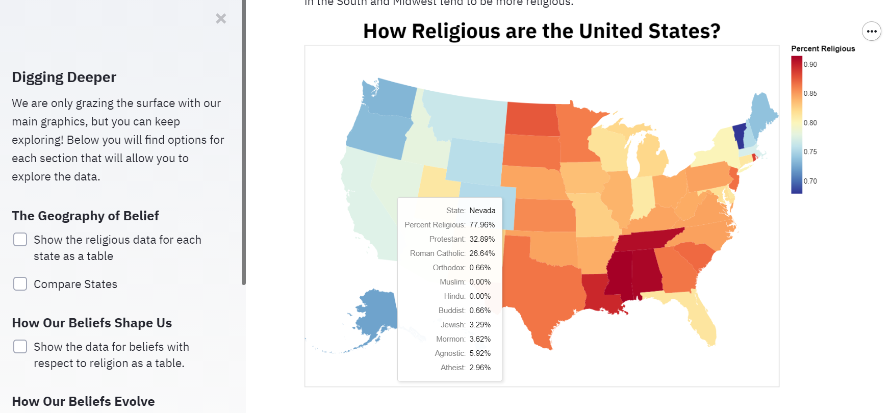
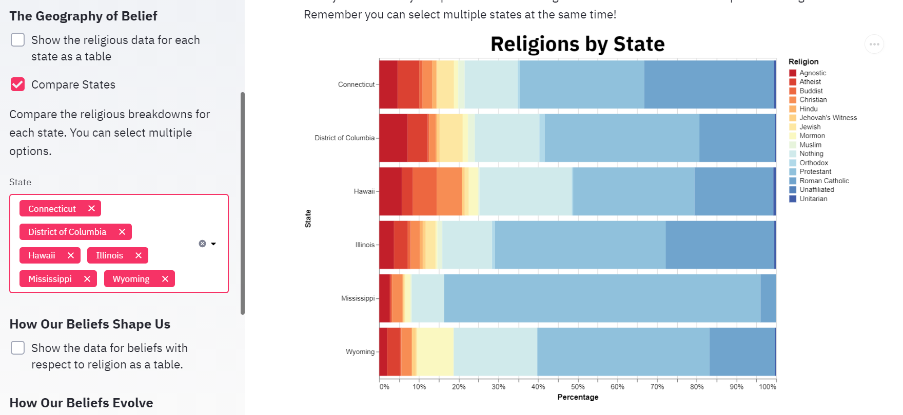
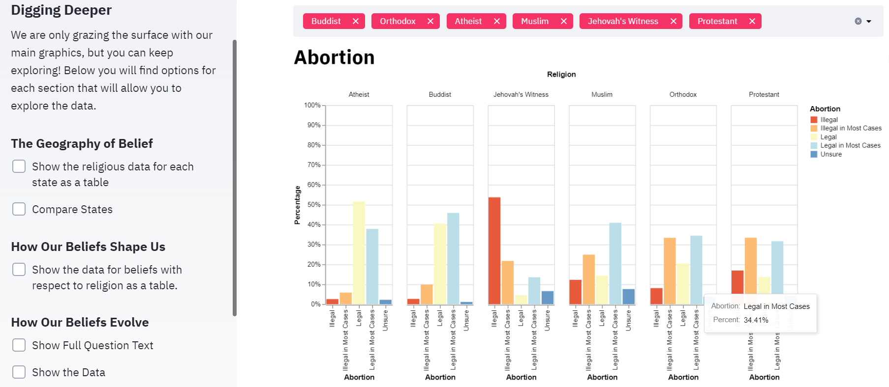
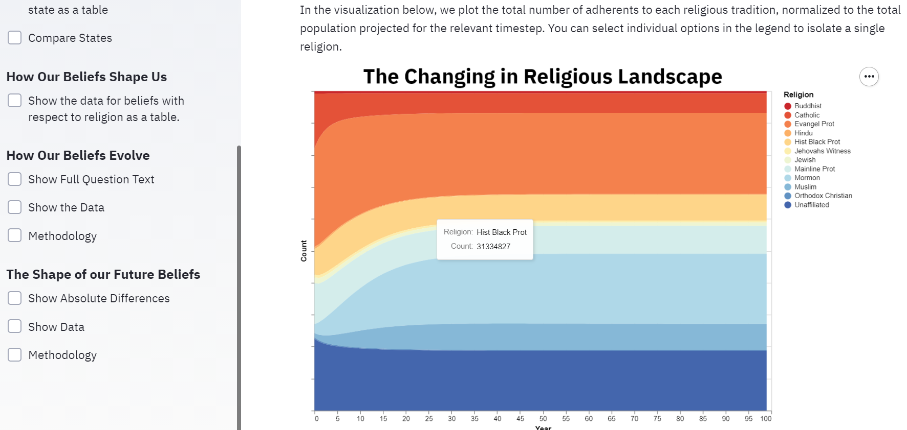

# The Shape of Belief

_Abby Vorhaus and Kyle Dotterrer_

_CMU 05-839: Interactive Data Science_

_16 March 2021_

## Abstract

The Shape of Belief

Beliefs are one of the most important things in human life. They determine the way we think; how we act; who we are. In the history of human endeavor, few belief systems have exerted a greater impact on our collective consciousness than religious faith. Many of our traditions date back millennia and have evolved symbiotically with us through the years, simultaneously shaping and being shaped by our collective will. 

In this project, we examine the results of The Pew Research Center's [2014 Religious Landscape Survey](https://www.pewforum.org/2015/05/12/americas-changing-religious-landscape/) to get a small glimpse into religious belief in the United States and its ongoing confrontation with modernity.

## Project Goals

_Describe the question that you are enabling a user to answer. The question should be compelling and the solution should be focused on helping users achieve their goals._

We stylize our application as an exploration of the "shape of belief." Obviously, this is a vague title, but we adopt it in order to reflect the broadness of the topic. As is stated in the introduction section of the application itself, religious belief is a complex topic that has many different dimensions. It would be naive to believe that we can capture the entirety of this complexity in a single application, much less one as limited as this one.

The goal of our project, therefore, is to provide a concise description of the data available in Pew's 2014 Religious Landscape Survey. From a cursory examination of the dataset, it is difficult to extract many conclusions regarding the high-level structure of religious belief in the United States. The dataset is wide (nearly 200 columns) and the individual columns must be manually mapped to the questions to which they correspond in order to recover any meaningful information. Beyond the preprocessing necessary to analyze the dataset, we construct several interactive visualizations with accompanying narrative elements to allow users to quickly achieve an understanding of Pew's results.

The question we intend to answer is: _how do American's religious beliefs interact with other aspects of their identity?_ We explore this question along three primary dimensions:

- _Geography_: How does one's physical location influence their beliefs?
- _Correlation_: How do one's beliefs influence their perspective on seemingly disparate topics? Which way does causation swing?
- _Time_: How do one's beliefs change over time? How do our collective beliefs evolve at the societal level?

The design rationale underlying the specific sections devoted to each of these particular themes is described below.

## Design

_How did you choose your particular visual encodings and interaction techniques? What alternatives did you consider and how did you arrive at your ultimate choices?_

We wanted to create visualizations that allowed users to interact with and easily visualize the religious survey data. We wanted to allow self exploration as much as possbile so that the user could discover their own insights. The chart choices were driven by a desire to effectively display the data but with enough variety in chart type that the user stays engaged. This was also a driving factor in our decision to set up the app in the form of a narrative. We also choose a base color palette and font style in order to allow for a more cohesive flow and user experience as they navigate the app.  

Below, we break down the design for each of the component visualizations we constructed for our project.

**The Geography of Belief**

In this interactive visualization we seek to create a way to easily explore the distribution of religious beliefs in the United States. The first visualization provides the big picture of how religious the United States are broken down by each state. This is the big idea, but then a user can explore further by comparing individual states. This graphic is a stacked bar graph that more clearly shows the 
proportion of each state that subscribes to each of the major religions. 

**How Our Beliefs Shape Us**

In this interactive visualization we seek to discover the ways in which our religious faith correlates with other belief systems. Respondents were asked several questions about their ideology. This was then tied to which religion they claimed to subscribe to. This provides a holistic view of religions and a selection of ideologies. This graphic was a grouped bar chart so the user can see the distribution within each religion as well as compare against different religions. 

**How Our Beliefs Evolve**

In this interactive visualization we seek to discover the manner in which religious faith, as measured by the various metrics and questions present in the Pew survey, change over the various stages of human life. Stages here means the age of the respondent. Challenging religious questions were asked and this was tied to the respondent's age. The result is a visualization where the user can see how opinions and the proportion of people who hold those opinions change as the individual ages. It may also provide insight about the change of belief systems across generational lines. 

**The Shape of our Future Beliefs**

In this interactive visualization we seek to hypothesize what the future distribution of religious belief might look like in the United States. This visualization is based on [analysis performed by Leah Libresco](https://fivethirtyeight.com/features/evangelical-protestants-are-the-biggest-winners-when-people-change-faiths/) from [FiveThirtyEight](https://fivethirtyeight.com/). In Ms. Libresco's original work, she computes a transition matrix that encodes the rates of transition between various religious faiths based on the results of the most recent Pew Research study as well as previous iterations. Here, we utilize this transition matrix to project possible future proportions of religious adherents. It is important to note, however, that this analysis is relatively simple, and lacks much of the complex modeling of social dynamics that would likely be required to make projections such as this one with any degree of long-term accuracy.

## Development

_Describe how the work was split among the team members. Include a commentary on the development process, including answers to the following questions: Roughly how much time did you spend developing your application (in people-hours)? What aspects took the most time?_

Our development process began with identifying the dataset that we wanted to work with, and the story we wanted to tell. There were plenty of interesting datasets suggested in the writeup for this assignment, so determining the particular dataset that we wanted to work with was no easy task. Eventually, we settled on the 2014 Pew Religious Landscape Survey dataset because this was a topic that both of us found intellectually engaging, but also one in which we felt there was space to develop useful visualizations that actual reveal insights of which we were previously unaware.

Once we had identified the dataset, we partitioned the overall arc of the story we wanted to tell into discrete sections. To do this, we examined the data available to us in the dataset and developed some questions that we thought we might be able to answer based on the available data. The questions that we settled on are described in the _Design_ section above.

With the overall narrative of the project established, we were able to split the remaining work of developing the visualizations evenly between the two of us. Abby worked on the _Geography_ and _Connection_ sections, while Kyle worked on the _Evolution_ and _Future_ sections. With this breakdown, we were able to work concurrently (often in the same file) without encountering excessive merge conflicts.

Overall, we spent (approximately) twenty people-hours working on the application itself. This includes preprocessing of the dataset, developing the visualizations, and authoring the narrative elements of the application.

The aspect that took the most time was definitely the translation of visualizations that we had in our heads to realization in code that actually allowed us to render the visualization. We found that while the Altair library allows one to concisely render an elegant visualization, it often assumes a very specific format for the input data. Our dataset was relatively difficult to work with in this regard, and required a large amount of preprocessing and wrangling in order to prepare it for use in Altair charts.

## Success Story

_Describe an insight or discovery you gain with your application that relates to the goals of your project._

**The Geography of Belief**
 
Here there was a significant amount of confirmation of previously held beliefs. For example, we expected to see the Southern states have a high percent of the population claim to be religious. However, over 90% in several was even higher than expeted. Moreover, we found it interesting that there was some clustering of where certain religions were more prominent. For example, the states surrounding Utah had a much higher percentage of Mormonism. Roman Catholics were prominent in the Northeast and even a small majority in a couple states yet had a much smaller presence elsewhere. 

**How Our Beliefs Shape Us**

We were surpised about the consistency that existed for certain religions on certain issues and the lack thereof for other issues. For example, we were surprised that Roman Catholic individuals were fairly evenly divided on the issue of abortion. In contrast, Jehovah's Witness respondees were overwhelmingly against abortion and we had expected the Roman Catholic chart to mirror this one. We also found the even splits on certain issues to be surprising as well. Homesexuality and Gay Marriage (note this is 2014 data so likely outdated to some degree) saw many of the many religions be split evenly on both sides of the fence. This likely indicates a scale of strictness within the umbrella of a religion. 

**How Our Beliefs Evolve**

We found it interesting that there was a tendency to become more religious (or at least a greater subset of the population is religious) as individuals age and the shadow of death begins to loom. It seems that individuals start taking religion with greater seriousness as they often provide some degree of comfort or certainty about post-death.

**The Shape of our Future Beliefs**

We were quite surprised at the religions that are projected to lose or gain a significant number of individuals. The huge projected gain of Moromonism was surprising (noting that these are indeed projects based on current distributions and religious growth). Additionally, the biggest loser being Roman Catholicism was interesting. We attributed this to the shifts socially in society that stands in stark constrast to some of the base belief sets of Roman Catholicism. 
